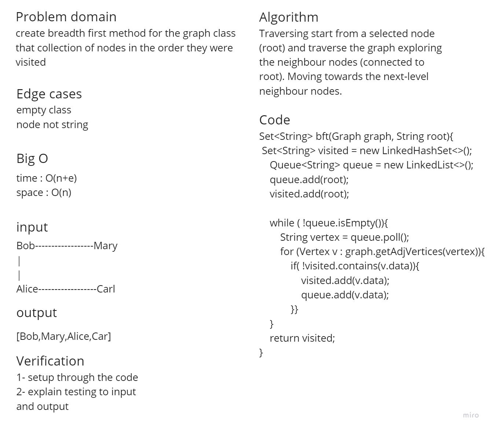

# Graphs
A graph is a non-linear data structure that can be looked at as a collection of vertices (or nodes) potentially connected by line segments named edges.

Here is some common terminology used when working with Graphs:

1- Vertex - A vertex, also called a “node”, is a data object that can have zero or more adjacent vertices.
2- Edge - An edge is a connection between two nodes.
3- Neighbor - The neighbors of a node are its adjacent nodes, i.e., are connected via an edge.
4- Degree - The degree of a vertex is the number of edges connected to that vertex.

## Challenge 35
**Features**

Implement your own Graph. The graph should be represented as an adjacency list, and should include the following methods:

**add node**

* Arguments: value
* Returns: The added node
* Add a node to the graph

**add edge**

* Arguments: 2 nodes to be connected by the edge, weight (optional)
* Returns: nothing
* Adds a new edge between two nodes in the graph

If specified, assign a weight to the edge. Both nodes should already be in the Graph

**get nodes**

* Arguments: none
* Returns all of the nodes in the graph as a collection (set, list, or similar)

**get neighbors**

* Arguments: node
* Returns a collection of edges connected to the given node

Include the weight of the connection in the returned collection

**size**

* Arguments: none
* Returns the total number of nodes in the graph
# Challenge 36
Write the following method for the Graph class:

* breadth first
* Arguments: Node
* Return: A collection of nodes in the order they were visited.
* Display the collection

## Whiteboard Process

## Approach & Efficiency

Traversing starts from a selected node (root) and traverse the graph exploring the neighbour nodes (connected to root).
Moving towards the next-level neighbour nodes.

Big (O)

Time Complexity : O(n+e)
space Complexity : O(n)
