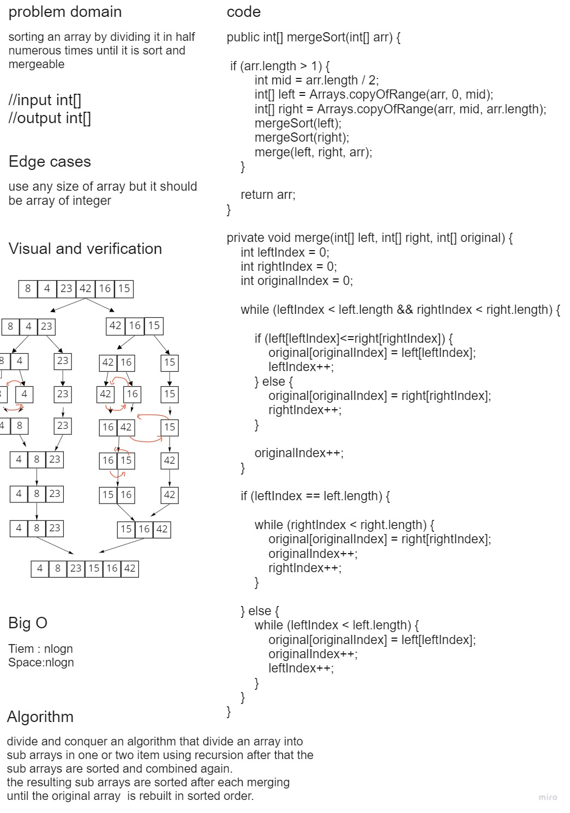
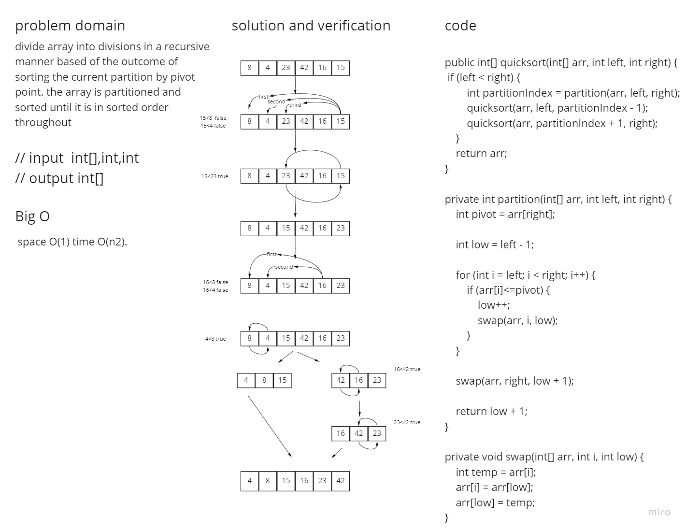

# Challenge26 Summary
<!-- Description of the challenge -->
Step through the procedure using the given sample array to trace the method. 
Document your reasoning by writing a blog post 
that includes a visual representation of 
the result after each iteration. Once you've 
finished your article, use the pseudocode given to 
create a functioning, tested version of Insertion Sort.
## Whiteboard26 Process
<!-- Embedded whiteboard image -->

## Approach & Efficiency(26)
<!-- What approach did you take? Why? What is the Big O space/time for this approach? -->
Time: O(n^2) / Space: O(1)
the time because there is two nested
loop
the space because we assert one
item each iterate

# Challenge27 Summary
<!-- Description of the challenge -->
Examine the pseudocode below, then follow the steps using the given 
example array to trace the method. 
Document your reasoning by writing a blog post 
that includes a visual representation of the result 
after each iteration. Once you've finished your 
article, use the pseudocode given to
create a functioning, tested Merge Sort solution.
## Whiteboard27 Process
<!-- Embedded whiteboard image -->

## Approach & Efficiency(26)
<!-- What approach did you take? Why? What is the Big O space/time for this approach? -->
Tiem : nlogn
Space:nlogn

# Challenge28 Summary
<!-- Description of the challenge -->

Examine the pseudocode below, then follow the steps using the given 
example array to trace the method. Document your 
reasoning by writing a blog post that includes a visual 
representation of the result after each iteration. Once you've 
finished your article, use the pseudocode given to create 
a functioning, tested version of Quick Sort.

## Whiteboard28 Process
<!-- Embedded whiteboard image -->

## Approach & Efficiency(26)
<!-- What approach did you take? Why? What is the Big O space/time for this approach? -->
explaind in whitboard