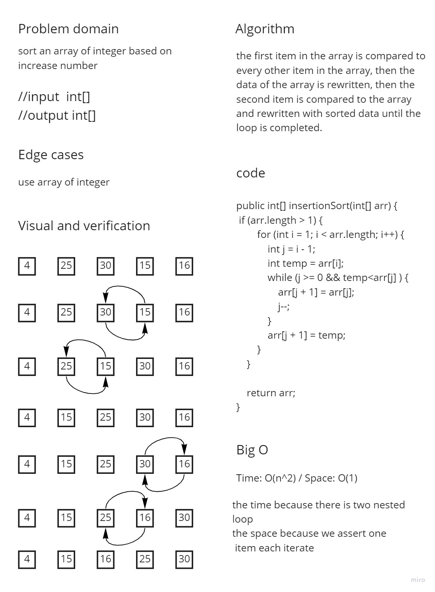

# Challenge Summary
<!-- Description of the challenge -->
Step through the procedure using the given sample array to trace the method. 
Document your reasoning by writing a blog post 
that includes a visual representation of 
the result after each iteration. Once you've 
finished your article, use the pseudocode given to 
create a functioning, tested version of Insertion Sort.
## Whiteboard Process
<!-- Embedded whiteboard image -->

## Approach & Efficiency
<!-- What approach did you take? Why? What is the Big O space/time for this approach? -->
Time: O(n^2) / Space: O(1)
the time because there is two nested
loop
the space because we assert one
item each iterate
